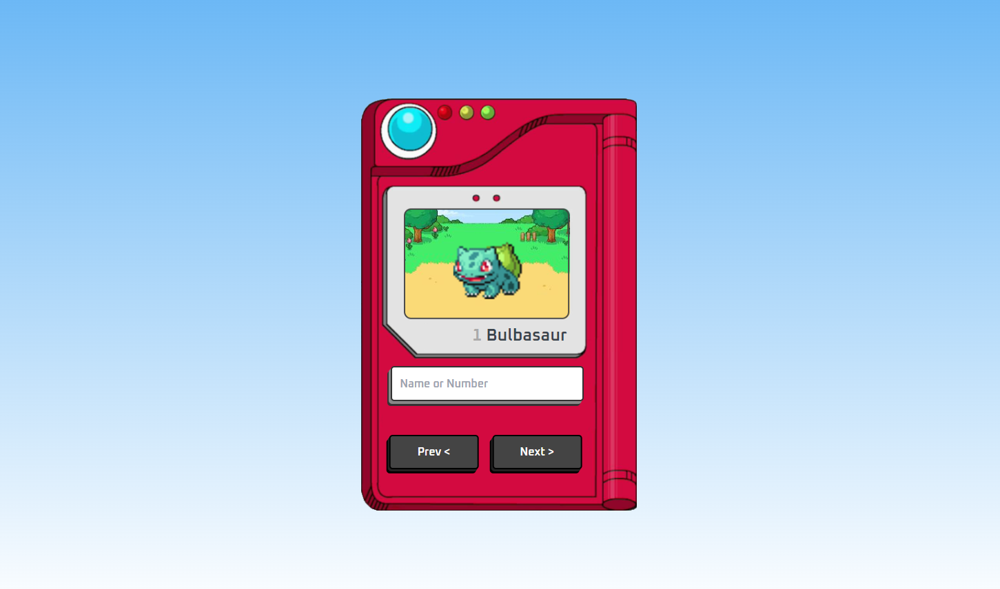

<div align="center">
  <h1>Pokédex API</h1>
  <p>Pokédex que utiliza a API PokéAPI para consulta de Pokémons por nome ou número de registro.</p>
  
</div>

# 📒 Índice
* [Descrição](#descrição)
* [Requisitos Funcionais](#requisitos)
* [Tecnologias](#tecnologias)
* [Design](#design)
  * [Cores](#cores)
  * [Fontes](#fontes)
* [Instalação](#instalação)
* [Licença](#licença)

# 📃 <span id="descrição">Descrição</span>
Pokédex que utiliza a API PokéAPI para consulta de Pokémons por nome ou numero de registro, utilizando as consultas por meio da fetch API do JavaScript.

# 📌 <span id="requisitos">Requisitos Funcionais</span>
- [x] Requisição a API<br>
- [x] Consulta por número de registro ou nome<br>
- [x] Exibição do Pokémon anterior ou proximo baseando-se no numero de registro<br>

# 💻 <span id="tecnologias">Tecnologias</span>
- **HTML**
- **CSS**
- **JavaScript**

# 🎨 <span id="design">Design</span>
- O modelo final para versão desktop e mobile está disponível na pasta `./design`

- <span id="cores">Cores<br></span>
  * #6ab7f5<br>
  * #fff<br>
  * #fff<br>
  * #aaa<br>
  * #3a444d<br>
  * #333<br>

- <span id="fontes">Fontes<br></span>
  * Oxanium, cursive

# 🚀 <span id="instalação">Instalação</span>
```bash
  # Clone este repositório:
  $ git clone https://github.com/CleilsonAndrade/pokedex-pokeapi
  $ cd ./pokedex-pokeapi
```

# 📝 <span id="licença">Licença</span>
Esse projeto está sob a licença MIT. Veja o arquivo [LICENSE](LICENSE) para mais detalhes.

---

<p align="center">
  Feito com 💜 by CleilsonAndrade
</p>